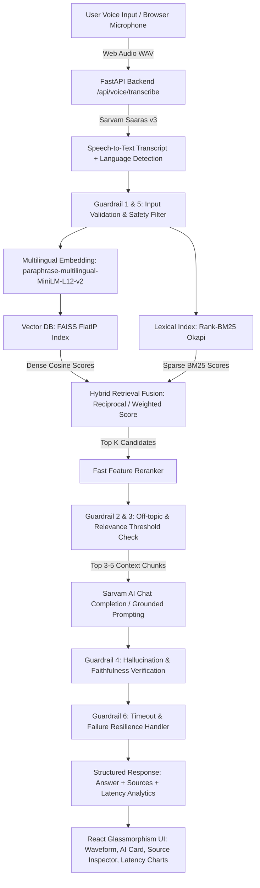

# VaaniRAG: Multilingual Voice-Enabled Retrieval Intelligence
> **HH Goa 2026 Shortlisting Task 2: Build a Voice-Enabled RAG Model**  
> *"Speak naturally. Retrieve precisely. Answer with evidence."*

[](https://fastapi.tiangolo.com)
[](https://react.dev)
[](https://vitejs.dev)
[](https://github.com/facebookresearch/faiss)
[](https://sarvam.ai)
[](LICENSE)

---

## 1. Project Overview & Objective

**VaaniRAG** is a production-grade, end-to-end Voice-Enabled Retrieval-Augmented Generation (RAG) platform built for the **HH Goa 2026 Shortlisting Challenge**. It enables users to speak natural language questions in any of **10+ Indian languages (Hindi, Marathi, Bengali, Tamil, Telugu, Gujarati, Kannada, Malayalam, Punjabi, etc.) or English** and receive strictly grounded, verified answers with full passage provenance and sub-200ms retrieval latencies.

The application indexes the multilingual **AI4Bharat/MSMARCO-XI** dataset and implements a multi-strategy chunking pipeline, dense FAISS vector indexing, sparse BM25 lexical search, reciprocal score fusion, cross-feature reranking, and a 6-layer guardrail safety harness.

---

## 2. System Architecture



---

## 3. Key Technical Innovations

### 1. Multi-Strategy Chunking Suite (`rag/chunker.py`)
Rather than relying on a single naive fixed-size chunker, VaaniRAG implements 5 dedicated chunking algorithms:
1. **Metadata-Enriched Provenance Chunker**: Enriches passages with language tags, query IDs, and domain markers for cross-lingual filtering.
2. **Passage-Aware MSMARCO Chunker**: Preserves native paragraph boundaries of MSMARCO without arbitrary sentence fragmentation.
3. **Sentence-Aware Multilingual Chunker**: Tokenizes with Indic punctuation (`।`, `!`, `?`) and applies sliding sentence windows.
4. **Semantic Distance Chunker**: Detects topic shifts using cosine distance inflection points.
5. **Fixed-Size Window Chunker**: Word/character sliding windows with configurable overlap.

### 2. FAISS + BM25 Hybrid Retrieval (`rag/retriever.py`)
- **Dense Vector Search**: FAISS `IndexFlatIP` utilizing normalized 384-dimensional multilingual embeddings (`paraphrase-multilingual-MiniLM-L12-v2`).
- **Sparse Lexical Search**: BM25 Okapi with unicode-safe multilingual tokenization.
- **Weighted Reciprocal Score Fusion**:
  $$\text{Score}_{\text{Hybrid}} = w_{\text{semantic}} \cdot S_{\text{FAISS}} + w_{\text{BM25}} \cdot S_{\text{BM25\_norm}}$$

### 3. Fast Cross-Feature Reranker (`rag/reranker.py`)
Takes the top 15-20 candidates and refines them to the top 3-5 passages in $< 5\text{ms}$ using term frequency density, exact phrase matching, and target language alignment bonuses.

### 4. 6-Layer Guardrail Safety Harness (`rag/guardrails.py`)
- **Guardrail 1 (Empty Query)**: Rejects empty or whitespace-only inputs.
- **Guardrail 2 (Off-Topic Detection)**: Rejects questions that cannot be answered using dataset context.
- **Guardrail 3 (Score Threshold)**: Halts generation if top retrieval score is below 0.35.
- **Guardrail 4 (Hallucination Prevention)**: Verifies n-gram and token overlap between LLM answer and retrieved source passages.
- **Guardrail 5 (Unsafe / Prompt Injection Detection)**: Blocks malicious prompt override attempts and jailbreaks.
- **Guardrail 6 (API Failure Resilience)**: Fallback extractive grounded synthesis if external LLM times out or is rate-limited.

### 5. Empirical Latency Analytics (`evaluation/latency.py`)
- Real measurement across each stage: STT, Query Embedding, FAISS Search, BM25, Hybrid Fusion, Reranking, Generation, and Guardrails.
- Calculations of **P50, P70, P100, Mean, Min, and Max** latencies.
- Sub-200ms compliance tracking for the core Retrieval/RAG pipeline.

---

## 4. Technology Stack

| Layer | Technologies |
|---|---|
| **Frontend** | React 19, Vite, TypeScript, Tailwind CSS, Lucide React, Recharts |
| **Backend** | Python 3.10+, FastAPI, Uvicorn, Pydantic v2, Pydantic-Settings |
| **Vector DB & Search** | FAISS CPU (`faiss-cpu`), Rank-BM25 (`rank-bm25`), NumPy |
| **Embeddings** | Hugging Face Sentence Transformers (`paraphrase-multilingual-MiniLM-L12-v2`) |
| **Speech-to-Text** | Sarvam AI (Saaras v3 STT) |
| **LLM Generation** | Sarvam AI (`sarvam-105b-conversations` / `sarvam-2b`) |
| **Dataset** | AI4Bharat / MSMARCO-XI (`ai4bharat/MSMARCO-XI`) |
| **Containerization** | Docker, Docker Compose |

---

## 5. Quick Start & Installation

### Prerequisites
- Python 3.10 or higher
- Node.js v18+ and npm
- (Optional) Docker & Docker Compose

### 1. Clone & Set Up Backend

```bash
# Navigate to backend
cd backend

# Create virtual environment
python -m venv venv

# Activate virtual environment
# Windows:
venv\Scripts\activate
# Linux/macOS:
source venv/bin/activate

# Install Python dependencies
pip install -r requirements.txt

# Configure Environment Variables
cp .env.example .env
```

Edit `backend/.env` with your Sarvam API Key:
```env
SARVAM_API_KEY=your_sarvam_api_key_here
SARVAM_STT_MODEL=saaras:v3
SARVAM_CHAT_MODEL=sarvam-105b-conversations
EMBEDDING_MODEL=sentence-transformers/paraphrase-multilingual-MiniLM-L12-v2
DATASET_NAME=ai4bharat/MSMARCO-XI
DATASET_LIMIT=10000
TOP_K=10
FINAL_K=5
SEMANTIC_WEIGHT=0.7
BM25_WEIGHT=0.3
RETRIEVAL_THRESHOLD=0.35
```

### 2. Build the Multi-Strategy Vector Index

```bash
# From backend directory
python scripts/build_index.py 500
```

### 3. Start the FastAPI Backend

```bash
uvicorn app.main:app --reload --host 0.0.0.0 --port 8000
```
Backend API will be running at `http://localhost:8000` (Swagger docs at `http://localhost:8000/docs`).

### 4. Start the React Frontend

In a separate terminal:
```bash
cd frontend
npm install
npm run dev
```
Frontend will be running at `http://localhost:5173`.

---

## 6. API Endpoints

| Method | Endpoint | Description |
|---|---|---|
| `GET` | `/api/health` | Service health status |
| `POST` | `/api/rag/query` | Execute text-based RAG query |
| `POST` | `/api/rag/voice-query` | Execute voice RAG query (audio base64) |
| `POST` | `/api/voice/transcribe` | Transcribe audio using Sarvam Saaras v3 |
| `GET` | `/api/latency` | Statistical P50/P70/P100 latency analytics |
| `GET` | `/api/evaluation/summary` | Retrieve latest benchmark evaluation results |
| `POST` | `/api/evaluation/run` | Trigger automated benchmark evaluation |
| `GET` | `/api/system/status` | System health, vector DB state, and chunk telemetry |
| `POST` | `/api/index/reload` | Reload vector index from disk |
| `POST` | `/api/index/build` | Rebuild full vector index |

---

## 7. Running Automated Tests

```bash
# From repository root
pytest backend/tests/ -v
```

Test suite verifies:
- `test_chunker.py`: All 5 chunking strategies
- `test_retrieval.py`: FAISS, BM25, Hybrid fusion, and Reranking
- `test_guardrails.py`: 6-layer guardrail validation & hallucination checks
- `test_api.py`: FastAPI endpoints and latency tracking

---

## 8. Docker Deployment

To run both backend and frontend containerized in a single command:

```bash
docker-compose up --build
```
Access the application at `http://localhost:8000`.

---

## 9. Submission Details & Team

- **Challenge**: HH Goa 2026 Shortlisting Task 2 — Build a Voice-Enabled RAG Model
- **Application**: VaaniRAG (Multilingual Voice-Enabled Retrieval Intelligence)
- **Hashtags**: `#RAGInGoa` `#HHGoa2026`
